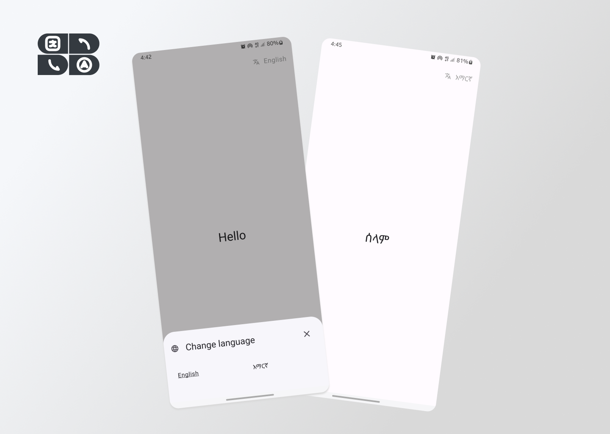

## Flutter Localization Starter

This repository provides a basic foundation for building Flutter applications with localization support. It's designed to streamline the process of integrating localization into your projects.


## Screenshots




## Getting Started

**Prerequisites:**

* Flutter development environment set up (https://docs.flutter.dev/)


1. **Clone the repository:**

   ```bash
   git clone https://github.com/53NX-8/flutter_localization.git

2. **Install dependencies:**

   ```bash
   flutter pub get


## Documentation


### Adding a New Language

Here's how to add a new language to your Flutter localization setup:

**1. Define Language Information:**

- Head over to `lib/src/constants/languages.dart`.
- Add an entry for your new language with the following details:

```dart
Language(
    name: 'Affan oromo',
    code: 'om',
    countryCode: 'ET', // Update based on your language's country code
),

  // Add entries for other languages following the same format
static List<LanguageModel> languages = [
    LanguageModel(name: "English", languageCode: "en", countryCode: "US"),
    LanguageModel(name: "አማርኛ", languageCode: "am", countryCode: "ET"),
    ...
];
```

**2. Create Translation File:**

- In `lib/src/assets/langs`, create a new JSON file named using the same language code you defined in step 1 (e.g., om.json).
- Inside this file, define your key-value pairs for the translation strings:

```json
{
  "title": "My Flutter App",
  "greeting": "Hello, World!",
  // Add more key-value pairs for your app's strings in your language
}
```

### Using Translations in Your Code

Here's how to use translations in your app:

**1. Import the Get Package:**

```dart
import 'package:get/get.dart';
```

**2. Access Localized Strings:**

- Use `"translationKey".tr` syntax to access translated strings from your components:

```dart
Text(
   "greeting".tr,
   style: Theme.of(context).textTheme.headlineLarge,
),

```
## Contributing

Contributions are always welcome!

We welcome contributions to improve this project. Feel free to submit pull requests with enhancements or bug fixes.


## License

This project is licensed under the [MIT License.](https://choosealicense.com/licenses/mit/)

